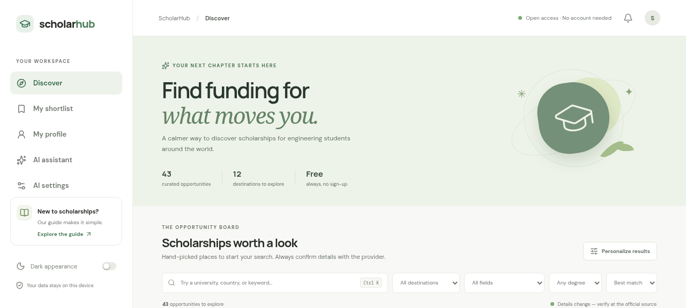
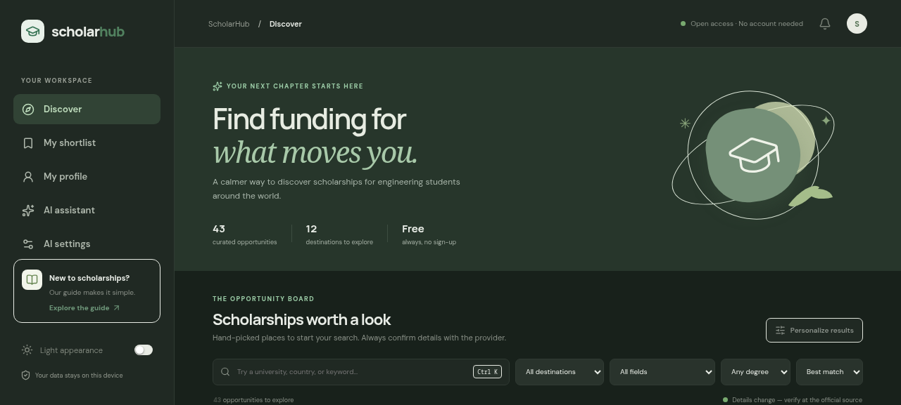

# ScholarHub

A small, open-source scholarship discovery companion for engineering students. Search a curated starter catalog, keep a private shortlist, and save study preferences locally—no account or backend required.

> **Data coverage is intentionally a starter set, not the requested complete directory.** This release contains 42 discovery records covering 12 destinations. Many details (especially annual deadlines, award values, and country-specific eligibility) change. Unknown values are intentionally omitted; every entry links to its official source and records the date a contributor last checked it. Verify all information before applying.

## Features

- Responsive scholarship discovery cards with keyword, destination, field, and degree filters.
- Keyboard accessible: visible focus rings on every control, a detail dialog that traps focus and closes on Escape, and a search shortcut (Ctrl/⌘ K).
- Locally saved shortlist and profile; optional dark appearance.
- Simple transparent profile-fit heuristic (not an eligibility determination).
- Scholarship detail view with official links and explicit verification reminders.
- Provenance-aware deadlines: a closing date is shown only when the catalog carries one, next to the date the official source was last checked.
- Offline assistant guide for search planning; it does not call a model or claim to verify eligibility.
- AI settings placeholder. No API key is stored or transmitted; provider adapters and model testing are not implemented yet.
- JSON catalog and schema documentation designed for community contributions.

## Demo / screenshots

The discover view, in both themes (captured 2026-10-07):





Run the development server (`npm run dev`) to try it locally.

## Tech stack

React, Vite, plain CSS, Lucide icons, static JSON, and browser localStorage. No server/database is required. Google Fonts are an optional external font resource; fallback system fonts are available.

## Quick start

Requirements: Node.js 20+ and npm.

```sh
npm install
npm run dev
```

Open the URL printed by Vite. For a static production build:

```sh
npm test            # schema and integrity checks (offline)
npm run check:links # also fetches every official link (needs the network)
npm run build
npm run preview
```

The generated `dist/` directory can be deployed to Vercel, Netlify, or GitHub Pages as a static site. Configure the host's base path when deploying under a subpath.

## Data and verification

The canonical starter catalog is [`data/scholarships.json`](data/scholarships.json). Its format and status semantics are described in [`docs/DATA-SCHEMA.md`](docs/DATA-SCHEMA.md). These records are discovery leads, not verified open awards. Every record carries a `source_url` and the `last_verified` date on which a contributor read it. Award amounts and deadlines are populated only where the official page stated them: seven records carry a single verified closing date, while several carry a deadline window, field-split dates, or a country-specific rule in `deadline_notes` rather than a misleading single date. Do not infer that an opportunity is open. Official sources linked in each record take precedence over this repository.

Country/program coverage currently includes selected opportunities in the USA, China, Germany, UK, France, Netherlands, Switzerland, Sweden, broader Europe, Australia, and New Zealand, plus programmes with no single host country. Broader Europe has the most depth (15 records), then China, New Zealand and the United States (4 each). Coverage is no longer degree-only: `degree_level` accepts `Non-degree`, which records funded short courses, cohort training and professional fellowships that award a certificate rather than a degree — currently the New Zealand Thematic and Vocational short-term schemes. Seven records carry a single verified closing date (Knight-Hennessy Scholars, ETH Zurich ESOP, the TU Delft Justus & Louise van Effen scholarship, the Erasmus Mundus Flood Risk Management and Groundwater and Global Change master's, the KTH Scholarship and EMerald); the rest carry an application window or a country-specific rule in `deadline_notes`. Not every listed country or field has a verified matching award. Broader Europe now reaches the Phase-1 target of 15–25 at its lower bound (15), but no other region does, so that target is **not complete**.

## Privacy

There is no login. Profile and shortlist data are stored in localStorage in the browser. Do not use a shared browser for private information. The AI settings page is a placeholder; no provider request currently happens. If provider integration is added, it must clearly explain that prompts leave the browser and go to the selected provider.

## Documentation

- [Architecture](docs/ARCHITECTURE.md)
- [Roadmap](docs/ROADMAP.md)
- [Development progress](docs/PROGRESS.md)
- [Data schema and verification](docs/DATA-SCHEMA.md)
- [Application notes](docs/API.md)
- [Contributing](CONTRIBUTING.md)
- [Changelog](CHANGELOG.md)

## Roadmap

### Phase 1 — current foundation (in progress)
- [x] Public client-side app, search, filters, saved list, profile storage, responsive layout.
- [x] Initial sourced scholarship discovery leads and data contribution schema.
- [x] Source provenance and link liveness: every record carries a dated `source_url`, and `npm run check:links` fails on a dead official link.
- [x] Deadline display with provenance, plus `deadline_notes` for cycles that have no single date.
- [ ] Expand to 15–25 **individually verified** active/relevant entries per requested country or region.
- [ ] Add verified program/field coverage and regular human review of dates and terms.
- [x] Accessibility tested and screenshots added: WCAG AA contrast measured in both themes, visible keyboard focus, a focus-trapped dialog that closes on Escape, labelled controls and live regions (2026-10-07).

### Phase 2 — planned
- Add Canada, Japan, South Korea, India, Middle East, Africa, and South America.
- Add more academic fields (computer science, mechanical/electrical engineering, business, medicine, and others).

### Phase 3 — planned
- Community-maintained review cadence, optional update feeds, applicant experiences, and multilingual UI. Automated data collection must be reviewed by humans and respect source terms.

## License

MIT. See [`LICENSE`](LICENSE).
