# ScholarHub

A small, open-source scholarship discovery companion for engineering students. Search a curated starter catalog, keep a private shortlist, track the programmes you decide to go for against their deadlines, and keep a checklist of the documents you still need—no account or backend required.

> **Data coverage is intentionally a starter set, not the requested complete directory.** This release contains 50 discovery records covering 18 destinations. Many details (especially annual deadlines, award values, and country-specific eligibility) change. Unknown values are intentionally omitted; every entry links to its official source and records the date a contributor last checked it. Verify all information before applying.

## Built for every country, not one

ScholarHub is written to be read from **any** country. Choose your country of origin once and every card tells you where you stand:

- **A verdict on every card** — *Open to you*, *Not open to you*, *Check eligibility*, or *Choose your country* — computed from each record's structured nationality rules rather than from prose.
- **A country-aware filter** — "Open to my country" narrows the board to what you can actually apply for.
- **Country notes in the detail view** — quotas, age caps and national deadlines that apply only to your country, kept out of the general description so readers they don't apply to aren't told about them.
- **A picker over 202 countries** — real countries and territories only, each carrying its ISO 3166-1 alpha-2 code.

The distinction the catalog refuses to blur: **some schemes are answerable and some are not.** A programme open to any nationality says so. A programme with a published country list is checked against yours. But a programme restricted to a region, decided by bilateral agreement, or silent on nationality is reported as **check** — with what you need to look up — rather than guessed at. "The source does not say" is never rendered as "open to everyone."

## Features

- Responsive scholarship discovery cards with keyword, destination, field, degree, and **country-eligibility** filters.
- Keyboard accessible: visible focus rings on every control, a detail dialog that traps focus and closes on Escape, and a search shortcut (Ctrl/⌘ K).
- Locally saved shortlist and profile; optional dark appearance.
- Simple transparent profile-fit heuristic (not an eligibility determination). A programme you are not eligible for is scored down rather than recommended.
- Scholarship detail view with official links and explicit verification reminders.
- Provenance-aware deadlines: a closing date is shown only when the catalog carries one, next to the date the official source was last checked.
- **Application tracker** — mark the programmes you are actually going for, give each one a status (*Planning to apply* → *Preparing documents* → *Submitted* → *Awarded* → *Not selected*), and see a live countdown to its closing date. Sorted by urgency, with an alert for anything near or past its date.
- **Document checklist** on the profile page — tick off the documents you already have and see exactly which are still missing. It is degree-aware: a research proposal is required of a PhD goal and shown as optional for a Master's.
- Honest about the gaps: 13 of the 50 records carry a single verified closing date. The rest say *"No single closing date"* and keep their note — the tracker never invents one, and never drops a programme just because its window is unstated.
- Reminders stay on the device. Countdowns are computed from the catalog and your own clock; there is no notification permission, no service worker, and nothing runs while the tab is closed.
- **Connect your own AI model** — 21 providers across frontier labs (OpenAI, Anthropic, Google, xAI, DeepSeek, Mistral, Cohere), inference providers (OpenRouter, Groq, Together, Fireworks, DeepInfra, Cerebras, or any OpenAI-compatible endpoint), and local runtimes (Ollama, LM Studio, llama.cpp, vLLM, Jan, LocalAI). Requests go from your browser straight to the provider you chose; there is no ScholarHub server and no proxy.
- **Your key stays yours.** It is held in memory for the tab by default, and only written to this device if you tick a box that says so. It is never put in a request body, a log line, or an error message.
- **Model lists are read from the provider, not hard-coded** — a roster is stale within weeks. The small seeded list carries the URL each entry came from and the date it was read, and shows a dash wherever the source published nothing.
- **Antigravity (AGY) is explained, not faked.** It signs in through the local `agy` CLI, which a web page cannot reach, so the settings page says that and gives you the two routes that do work — the Gemini API, or a local OpenAI-compatible gateway in front of the CLI.
- **Replies stream** where the transport supports it — token by token, not after a pause. Streaming is attempted rather than assumed: it falls back to a single request when the browser cannot read a stream or the provider refuses, and the answer says which happened.
- **What each call cost**, estimated from the provider's published per-token price and the token count it reported. A model with no published price is reported as **uncosted, not $0.00** — a local model is the common case — and a cost known in only one direction is labelled as partial.
- **Optional model fallback**, which runs only after the first model fails and always says which model replied. Models are never swapped silently.
- **Offline assistant guide** by default: search planning from the catalog with no model involved. Connect a provider and it answers through your own model, grounded in the catalog and labelled as a model answer rather than catalog data.
- JSON catalog and schema documentation designed for community contributions.

## Demo / screenshots

The discover view, in both themes (captured 2026-10-07):


Choosing a country changes what every card says. Both captures below were taken with the country of origin set to Nepal:

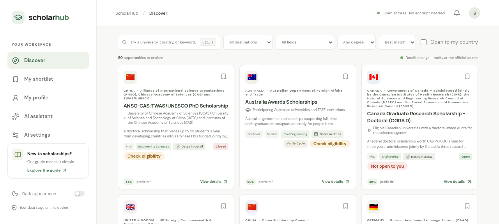

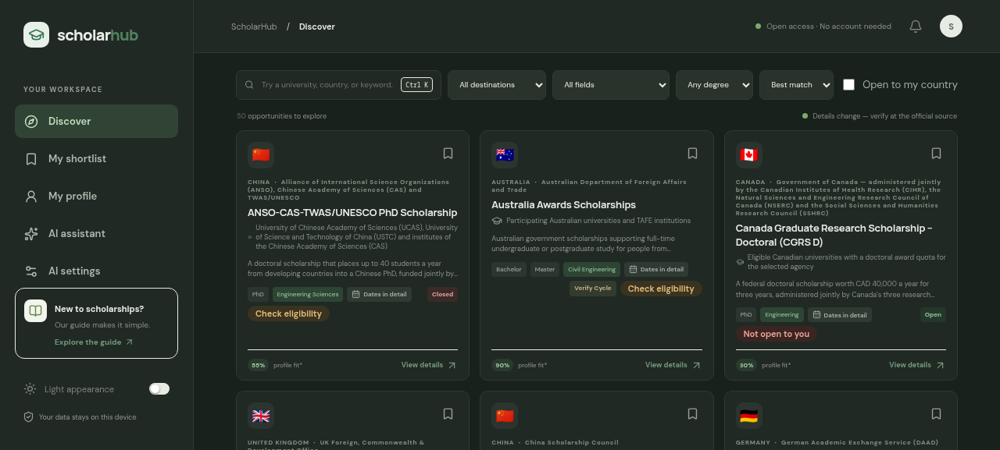

The application tracker — status pipeline, live countdowns, and an alert for anything near or past its date:

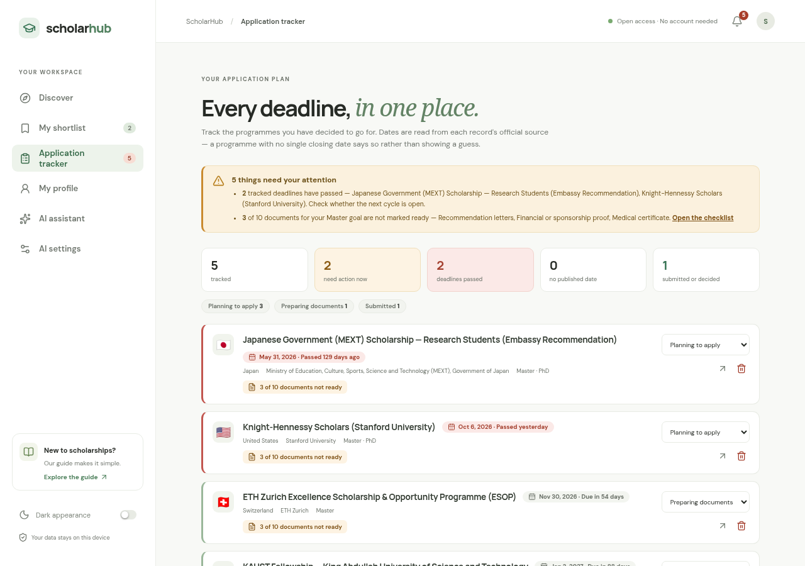

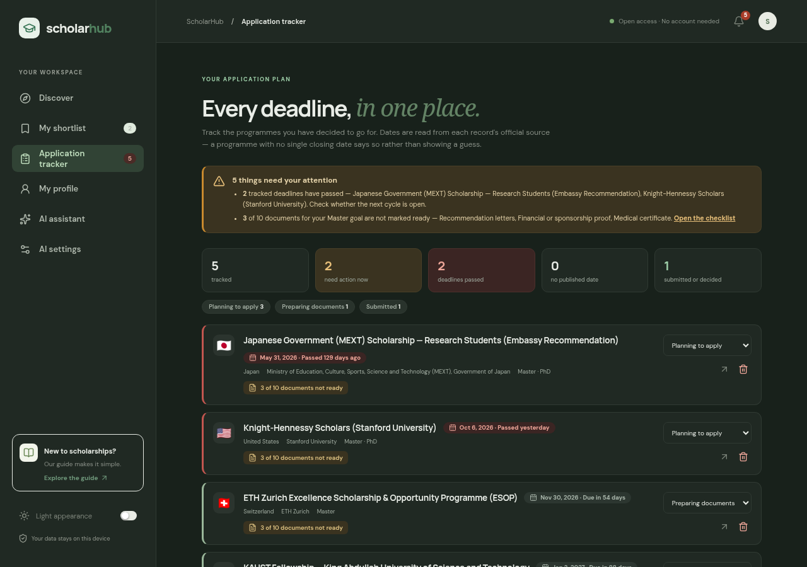

The document checklist on the profile page — what is present, what is not, and what the reader's degree goal actually requires:

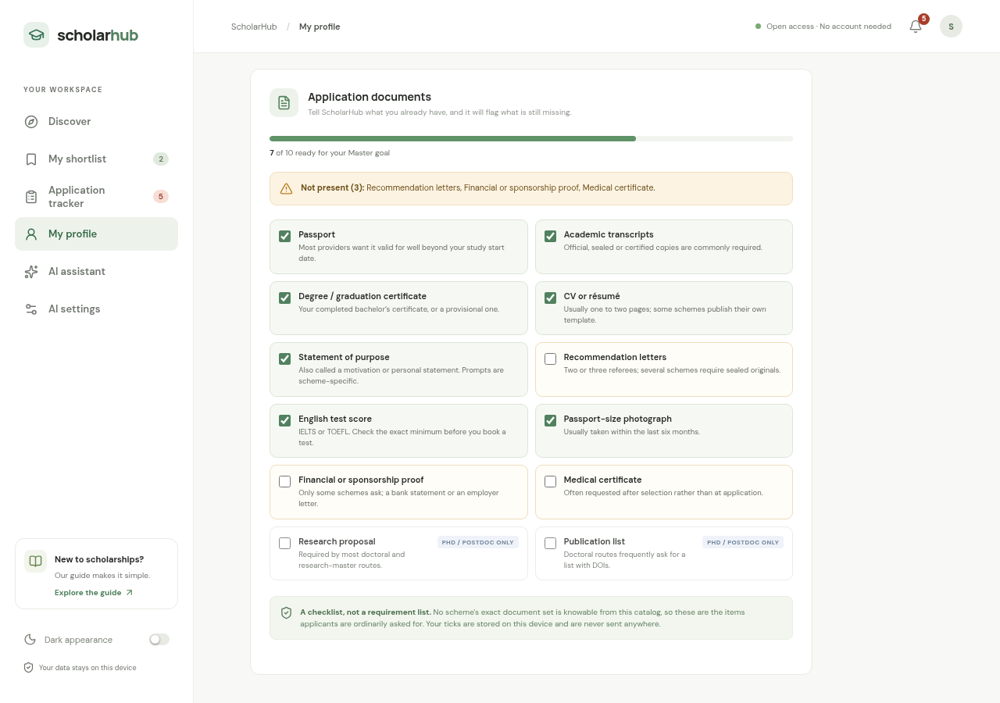

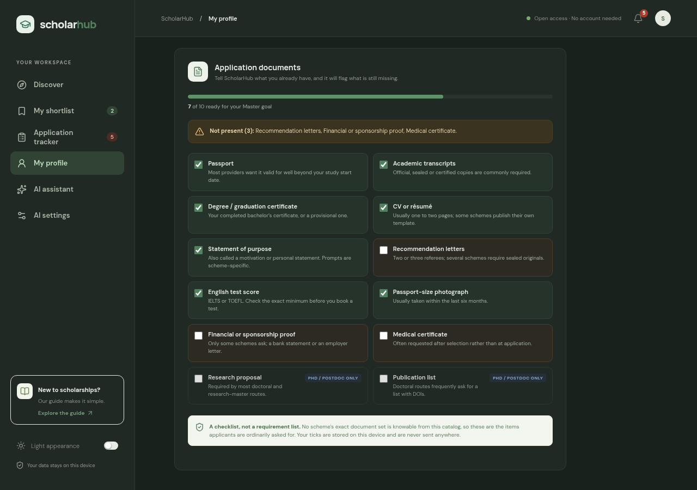

Reading your own documents — attach a transcript or CV and ScholarHub reads the figures out of it on this device, showing each one beside the text it came from so you can confirm or correct it. Nothing is uploaded, and a value is only used once you confirm it:

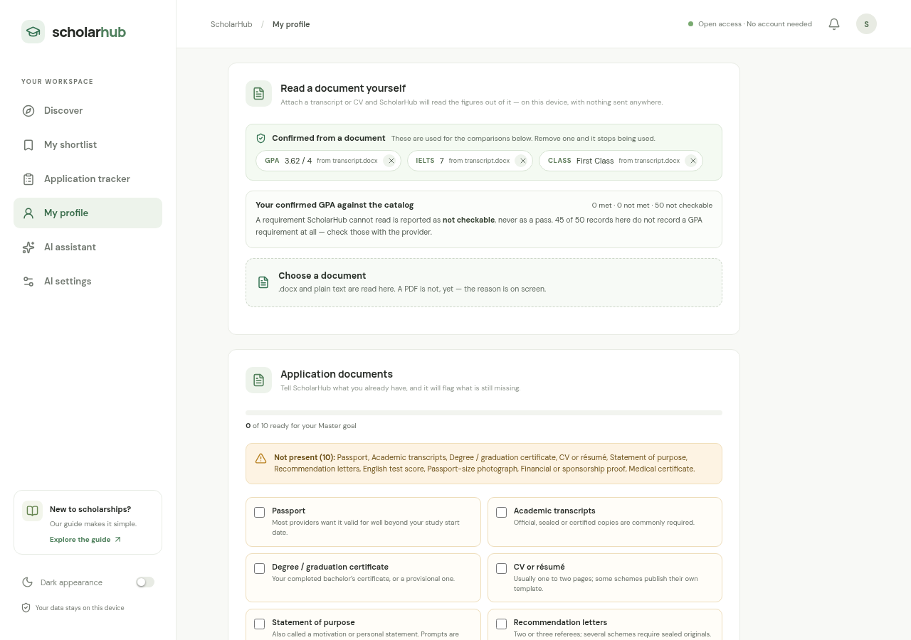

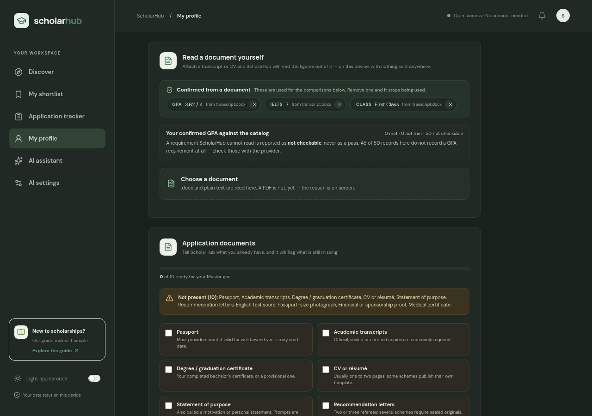

Connecting your own model — 21 providers grouped by how they work, each declaring how it authenticates:

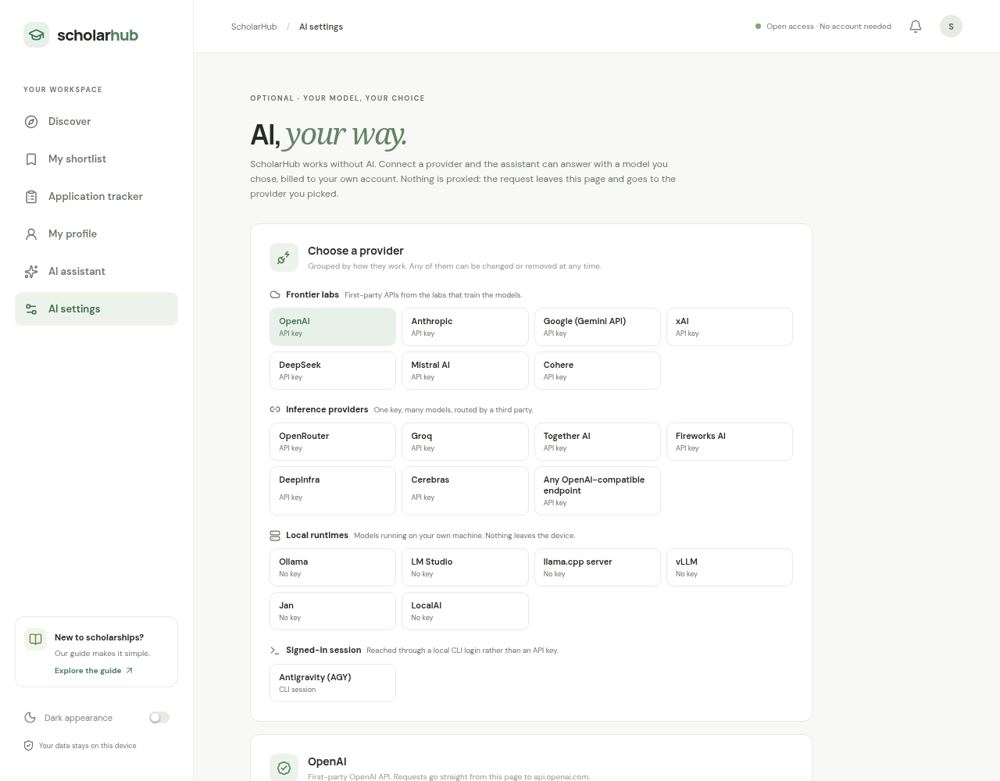

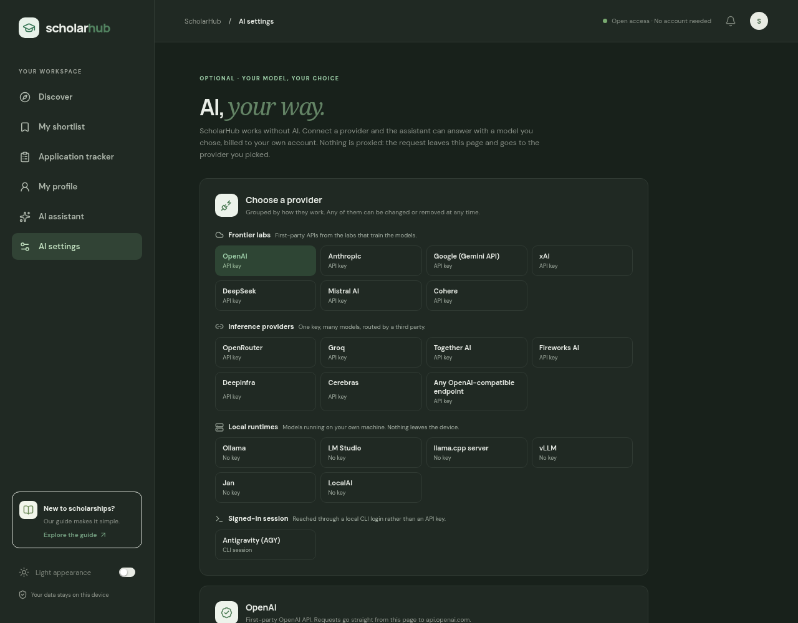

A selected provider, with the model list, the limits and prices it publishes, and a real connection test:

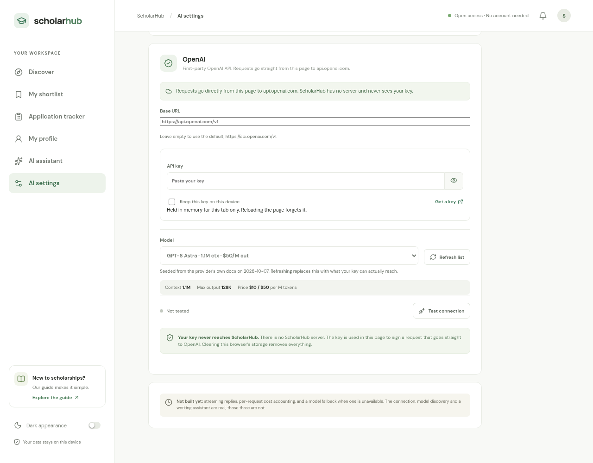

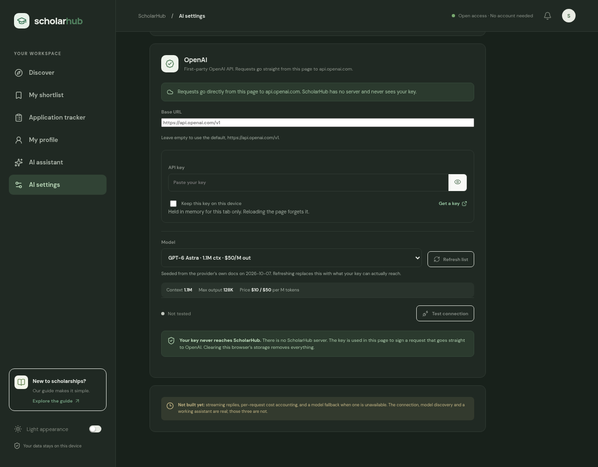

Antigravity signs in through a local CLI, which a browser cannot reach — so the page explains that and gives the routes that work, rather than a login form that could never succeed:

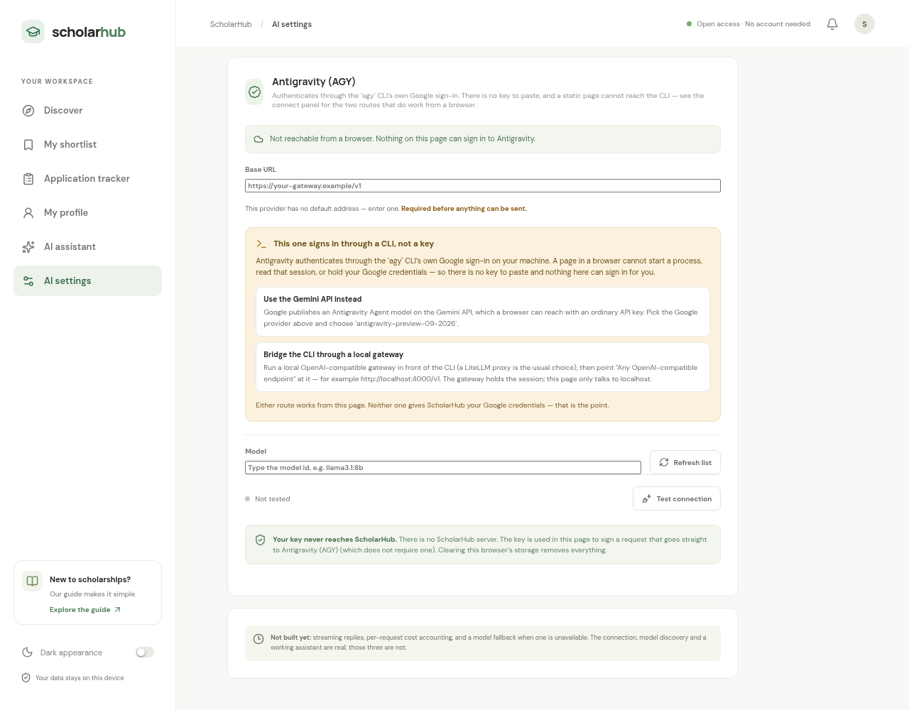

A local runtime connected and tested: model discovery, the fallback selector, and a session cost that is reported as **uncosted rather than $0.00** because a local model publishes no price:

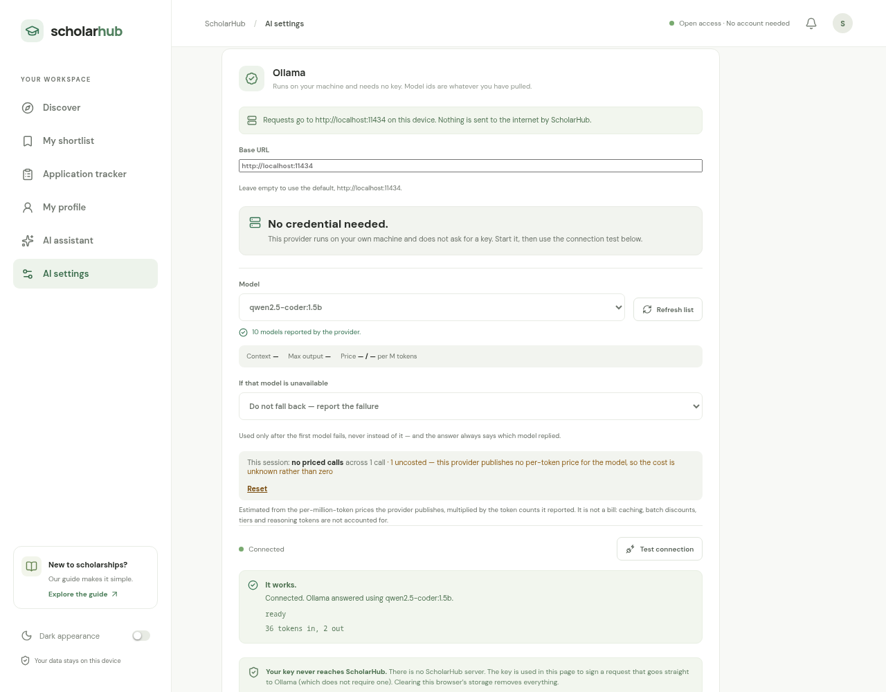

Run the development server (`npm run dev`) to try it locally.

## Tech stack

React, Vite, plain CSS, Lucide icons, static JSON, and browser localStorage. No server/database is required. Google Fonts are an optional external font resource; fallback system fonts are available.

## Quick start

Requirements: Node.js 20+ and npm.

```sh
npm install
npm run dev
```

Open the URL printed by Vite. For a static production build:

```sh
npm test            # the canonical gate: unit tests, catalog + requirements validation, render smoke test (offline)
npm run check:links # also fetches every official link (needs the network)
npm run build
npm run preview
```

The generated `dist/` directory can be deployed to Vercel, Netlify, or GitHub Pages as a static site. Configure the host's base path when deploying under a subpath.

## Data and verification

The canonical starter catalog is [`data/scholarships.json`](data/scholarships.json). Its format and status semantics are described in [`docs/DATA-SCHEMA.md`](docs/DATA-SCHEMA.md). These records are discovery leads, not verified open awards. Every record carries a `source_url` and the `last_verified` date on which a contributor read it. Award amounts and deadlines are populated only where the official page stated them: thirteen records carry a single verified closing date, while several carry a deadline window, field-split dates, or a country-specific rule in `deadline_notes` rather than a misleading single date. Do not infer that an opportunity is open. Official sources linked in each record take precedence over this repository.

**Every change is checked before it can merge.** `npm test` is the canonical gate — unit tests, catalog validation, requirements validation, and a render smoke test that mounts all six views against both an empty and a populated browser, because rendering is the only thing that executes a view's branches. `.github/workflows/ci.yml` runs that same command on every pull request. The render smoke test exists because it did not, once: a view that threw on render shipped green through every check that existed at the time.

**Requirements are machine-readable in their own file.** [`data/requirements.json`](data/requirements.json) carries the comparable form of a programme's requirement, keyed by record id, validated against [`docs/REQUIREMENTS-SCHEMA.md`](docs/REQUIREMENTS-SCHEMA.md). Five records are present — the five whose requirement is a prose string, chosen because they are the hardest case, not because they are the easiest. The shape matters more than the count: `none-stated` ("the provider states there is no threshold") and `unstated` ("the catalog has not looked") are **opposite claims** that a single number field cannot tell apart, and a rule stated on four different GPA scales is recorded as four branches rather than reduced to one figure. Every requirement carries its `source` and `last_verified`. This file is the **shape** the sourcing pass will fill in; until that pass runs, the comparison engine honestly reports most programmes as not checkable.

Country/program coverage currently includes selected opportunities in the USA, China, Germany, UK, France, Netherlands, Switzerland, Sweden, Canada, Japan, South Korea, India, Saudi Arabia, broader Europe, Australia, and New Zealand, plus programmes with no single host country. Broader Europe has the most depth (15 records), then China (5), then New Zealand and the United States (4 each); Canada, Japan, South Korea, India and Saudi Arabia each hold a single record, opened across the last three releases. Coverage is no longer degree-only: `degree_level` accepts `Non-degree`, which records funded short courses, cohort training and professional fellowships that award a certificate rather than a degree — currently the New Zealand Thematic and Vocational short-term schemes. Thirteen records carry a single verified closing date (Knight-Hennessy Scholars, ETH Zurich ESOP, the TU Delft Justus & Louise van Effen scholarship, the Erasmus Mundus Flood Risk Management and Groundwater and Global Change master's, the KTH Scholarship, EMerald, the KAUST Fellowship, the Japanese Government MEXT Research Student scholarship, the Global Korea Scholarship for Graduate Degrees, the ICCR Sushma Swaraj Silver Jubilee Scholarship Scheme, PEC-PG Brazil, and the Pan African University Scholarship); the rest carry an application window or a country-specific rule in `deadline_notes`. **Six of those thirteen dates have already passed**, and the two oldest — PEC-PG Brazil and Pan African University — are reference dates from completed cycles rather than an open call, so the tracker will report them as passed. Not every listed country or field has a verified matching award. Broader Europe now reaches the Phase-1 target of 15–25 at its lower bound (15), but no other region does, so that target is **not complete**.

## Privacy

There is no login. Profile and shortlist data are stored in localStorage in the browser. Do not use a shared browser for private information. The AI settings page is a placeholder; no provider request currently happens. If provider integration is added, it must clearly explain that prompts leave the browser and go to the selected provider.

## Documentation

- [Architecture](docs/ARCHITECTURE.md)
- [Roadmap](docs/ROADMAP.md)
- [Development progress](docs/PROGRESS.md)
- [Data schema and verification](docs/DATA-SCHEMA.md)
- [Application notes](docs/API.md)
- [Reading your documents and comparing them to requirements](docs/DOCUMENT-INGESTION.md) — a design proposal, not implemented
- [Contributing](CONTRIBUTING.md)
- [Changelog](CHANGELOG.md)

## Roadmap

### Phase 1 — current foundation (in progress)
- [x] Public client-side app, search, filters, saved list, profile storage, responsive layout.
- [x] Initial sourced scholarship discovery leads and data contribution schema.
- [x] Source provenance and link liveness: every record carries a dated `source_url`, and `npm run check:links` fails on a dead official link.
- [x] Deadline display with provenance, plus `deadline_notes` for cycles that have no single date.
- [x] Application tracker with a status pipeline and live deadline countdowns, and a degree-aware document checklist on the profile page — both local-only, both refusing to invent a date (2026-10-07).
- [ ] Expand to 15–25 **individually verified** active/relevant entries per requested country or region.
- [ ] Add verified program/field coverage and regular human review of dates and terms.
- [x] Accessibility tested and screenshots added: WCAG AA contrast measured in both themes, visible keyboard focus, a focus-trapped dialog that closes on Escape, labelled controls and live regions (2026-10-07).
- [x] Bring your own AI model: 21 providers across frontier labs, inference providers, local runtimes and one CLI-session provider, with runtime model discovery, a real connection test and declared auth kinds (2026-10-07).

### Phase 2 — planned
- [x] Add Canada and Japan — Canada Graduate Research Scholarship – Doctoral, and the Japanese Government (MEXT) Research Student scholarship (2026-10-07).
- [x] Add South Korea and India — the Global Korea Scholarship for Graduate Degrees, and the ICCR Sushma Swaraj Silver Jubilee Scholarship Scheme, which is reserved for Nepal (2026-10-07).
- [ ] Add the Middle East, Africa, and South America.
- Add more academic fields (computer science, mechanical/electrical engineering, business, medicine, and others).

### Phase 3 — planned
- Community-maintained review cadence, optional update feeds, applicant experiences, and multilingual UI. Automated data collection must be reviewed by humans and respect source terms.
- AI: streaming replies, per-call cost estimation, and an explicit model fallback are done (2026-10-07). Still open: a request history that survives a reload, per-scholarship cost attribution, and any provider-specific SDK.

## License

MIT. See [`LICENSE`](LICENSE).
